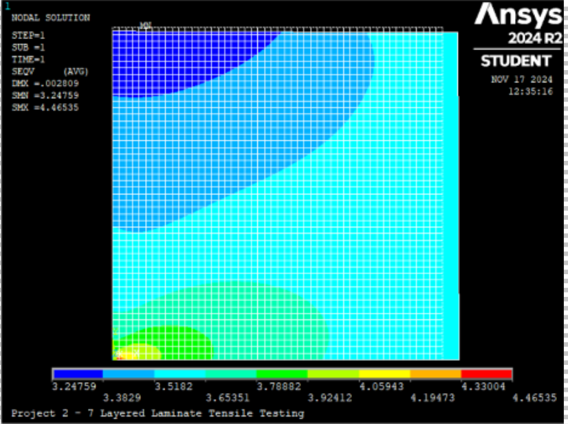
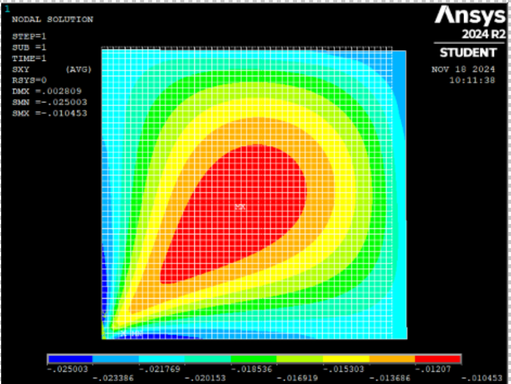
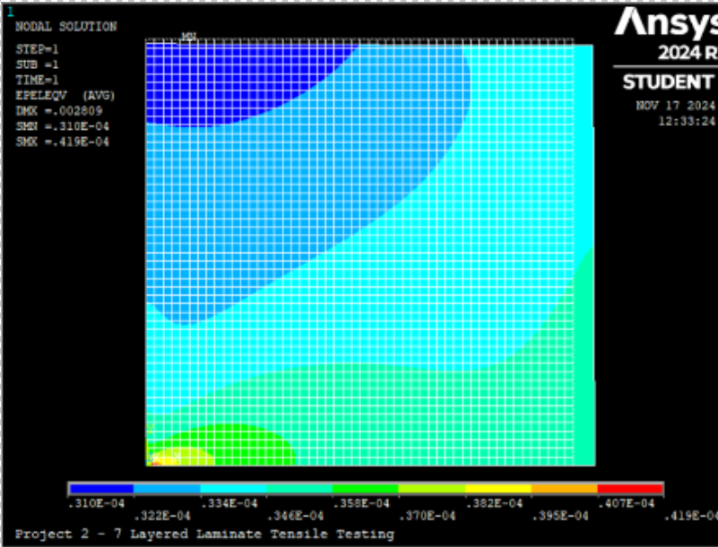

# ANSYS-Laminate-Tensile-Simulation
# Tensile Test at Various Angles for a Fiber-Reinforced Laminate

This repository contains the simulation files, images, and documentation for a tensile test conducted on a 7-layer composite laminate with different fiber orientations. The project utilized ANSYS APDL to study the mechanical behavior of the laminate under tensile loads applied at angles between 0° and 90°.

---

## Table of Contents
1. [Introduction](#introduction)
2. [Simulation Procedure](#simulation-procedure)
3. [Results](#results)
4. [How to Use](#how-to-use)
5. [Team Contributions](#team-contributions)

---

## Introduction

Composite materials exhibit anisotropic properties due to the orientation of fibers in their structure. In this project, we analyzed a 7-layer composite laminate with the stacking sequence [0/90/45/-45/45/90/0]. Key objectives:
- Model the laminate using ANSYS APDL.
- Evaluate mechanical behavior (Young’s modulus, Poisson’s ratio, stresses, and strains) under tensile loads at various angles.
- Compare simulation results with theoretical predictions using laminate theory (Chapter 5 equations).

---

## Simulation Procedure

### 1. Define the Model
- Used shell elements (SHELL181) to represent the composite layers.
- Applied material properties for each layer, including longitudinal modulus, transverse modulus, shear modulus, and Poisson's ratios.

### 2. Build the Model and Mesh
- Created a rectangular laminate of size 100x100 mm.
- Applied a uniform mesh with a 2x2 mm element size for accuracy.

### 3. Apply Boundary Conditions
- Symmetry constraints on two edges to simplify the problem and reduce computational effort.
- Constrained Z-axis displacements on the other two edges to restrict out-of-plane motion.

### 4. Conduct Tensile Tests
- Applied a 10 MPa tensile pressure on one edge along the X-axis.
- Rotated the laminate layers incrementally by 15° for each test (0° to 90°).

---

## Results

### Simulation Outputs:
- **Von Mises Stress:**  
  

- **XY-Axis Shear Stress:**  
  

- **Von Mises Strain:**  
  

---

## How to Use

1. Clone the repository:
   ```bash
   git clone https://github.com/JuneshG/ANSYS-Laminate-Tensile-Simulation
   cd laminate-tensile-test
